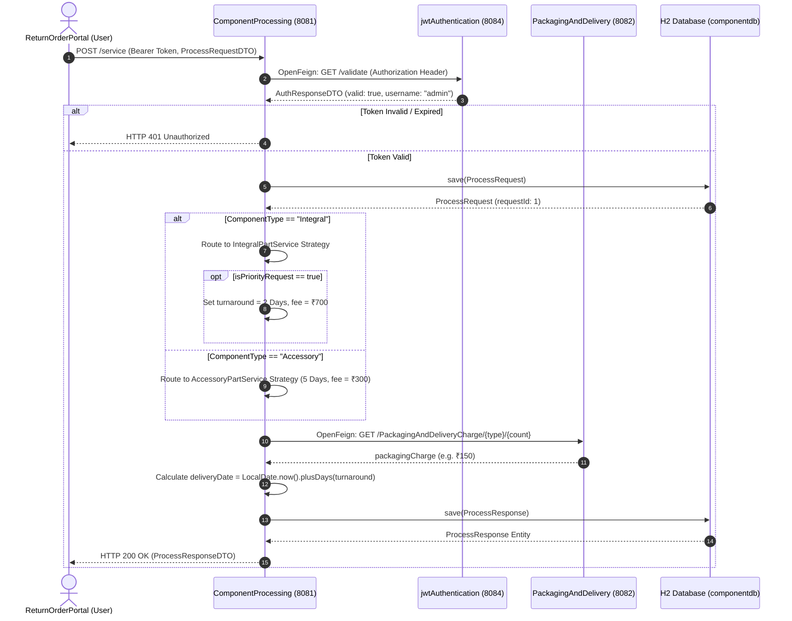
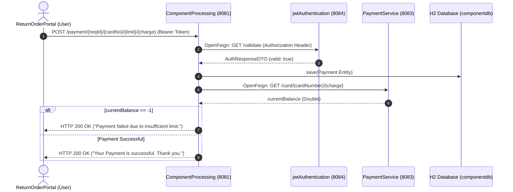

# High-Level Design (HLD) — Component Processing Microservice (`ComponentProcessing`)

## 1. System Overview & Core Purpose

The **Component Processing Microservice** (`ComponentProcessing`, running on port **8081**) is the core business logic engine of the Return Order Processing Platform. 

It receives defective component return requests, validates JWT authentication credentials with `jwtAuthentication` (Port 8084), calculates return processing fees and delivery turnaround dates based on component categories (**Integral** vs. **Accessory**), delegates tariff calculations to `PackagingAndDelivery` (Port 8082), and coordinates payment execution with `PaymentService` (Port 8083).

```
                            +----------------------------------+
                            |     ReturnOrderPortal (Web)      |
                            +----------------------------------+
                                             |
                                   HTTP POST | Authorization Header
                                             v
                            +----------------------------------+
                            |   ComponentProcessing (8081)     |
                            +----------------------------------+
                               /             |              \
               OpenFeign GET  /              | OpenFeign GET \ OpenFeign GET
                             v               v                v
                 +-------------------+  +-------------------+  +-------------------+
                 | jwtAuthentication |  | PackagingAndDeliv |  |  PaymentService   |
                 |     (Port 8084)   |  |     (Port 8082)   |  |    (Port 8083)    |
                 +-------------------+  +-------------------+  +-------------------+
```

---

## 2. Key Responsibilities

1. **Token Verification**: Intercepts HTTP requests carrying a `Bearer <JWT>` header and validates token authenticity via OpenFeign client calls to `jwtAuthentication/validate`.
2. **Strategy-Based Return Calculation**:
   - **Integral Components** (e.g. Laptops, Smartphones, Motherboards): Standard fee ₹500, 5 days turnaround. If `isPriorityRequest` is `true`, turnaround is expedited to **2 days** with a **+₹200** fee (total ₹700).
   - **Accessory Components** (e.g. Chargers, Cables, Headphones): Standard fee ₹300, 5 days turnaround.
3. **Inter-Service Orchestration**: Invokes `PackagingAndDelivery` to calculate packaging tariffs based on component type and defective quantity.
4. **Audit Persistence**: Persists return request transactions (`ProcessRequest`) and response audit logs (`ProcessResponse`) in the H2 database.
5. **Payment Processing Coordination**: Delegates credit card charge verification to `PaymentService`.

---

## 3. Microservice Interaction Sequence Diagram



---

## 4. Payment Execution Sequence Diagram



---

## 5. Security & Authorization Architecture

- **Stateless Web Security**: Spring Security 6 configures `SessionCreationPolicy.STATELESS` and permits public REST routing for `/service` and `/payment/**`.
- **Programmatic Token Validation**: Rather than enforcing local JWT decoding in every service, token verification is centralized via `AuthClient` OpenFeign calls to `jwtAuthentication`. This enforces single source of truth for secret keys and token revocation lists.

---

## 6. Resilience & Production Readiness

- **Externalized Downstream Endpoints**: Microservice URLs (`auth.service.url`, `packaging.service.url`, `payment.service.url`) are configured in `application.properties` and overridden via environment variables in Docker containerization.
- **Garbage-Collector Friendly DTOs**: Utilizes **Java 21 `record`s** for immutable, zero-boilerplate network payloads.
- **Docker Multi-Stage Build**: Packaged via Alpine Linux `eclipse-temurin:21-jre-alpine` running under non-root system user `appuser`.
