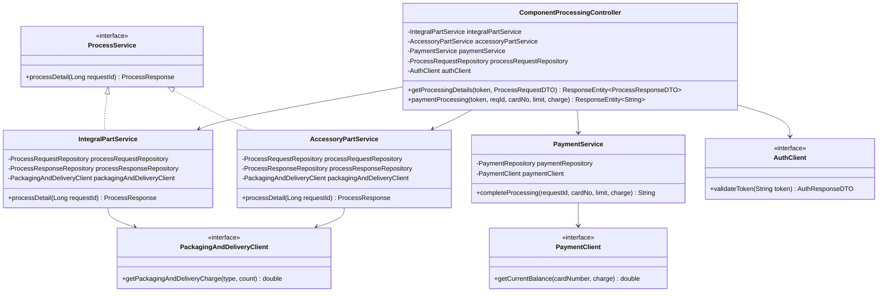
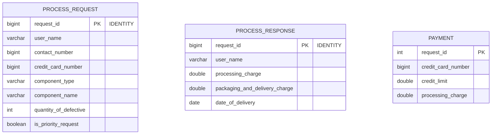

# Low-Level Design (LLD) — Component Processing Microservice (`ComponentProcessing`)

## 1. Class Diagram Architecture



---

## 2. Package & Structural Layout

```text
com.company.componentprocessingservice
├── client/                      # OpenFeign Feign Clients
│   ├── AuthClient.java          # Calls jwtAuthentication (Port 8084)
│   ├── PackagingAndDeliveryClient.java # Calls PackagingAndDelivery (Port 8082)
│   └── PaymentClient.java       # Calls PaymentService (Port 8083)
├── controller/                  # REST Controllers
│   └── ComponentProcessingController.java
├── dto/                         # Java 21 Record DTOs
│   ├── AuthResponseDTO.java
│   ├── ErrorResponseDTO.java
│   ├── ProcessRequestDTO.java
│   └── ProcessResponseDTO.java
├── entity/                      # JPA Database Entities
│   ├── Payment.java
│   ├── ProcessRequest.java
│   └── ProcessResponse.java
├── exception/                   # Exception Handlers
│   └── GlobalExceptionHandler.java
├── repository/                  # Spring Data JPA Repositories
│   ├── PaymentRepository.java
│   ├── ProcessRequestRepository.java
│   └── ProcessResponseRepository.java
├── security/                    # Spring Security Configuration
│   └── SecurityConfig.java
└── service/                     # Business Logic & Strategy Pattern
    ├── AccessoryPartService.java
    ├── IntegralPartService.java
    ├── PaymentService.java
    └── ProcessService.java      # Strategy Interface
```

---

## 3. Database Schema DDL & Entity Relationship (ER) Diagram



### SQL DDL Statements (H2 / MySQL Compatible)

```sql
CREATE TABLE process_request (
    request_id BIGINT AUTO_INCREMENT PRIMARY KEY,
    user_name VARCHAR(255) NOT NULL,
    contact_number BIGINT NOT NULL,
    credit_card_number BIGINT NOT NULL,
    component_type VARCHAR(50) NOT NULL,
    component_name VARCHAR(255) NOT NULL,
    quantity_of_defective INT NOT NULL,
    is_priority_request BOOLEAN NOT NULL
);

CREATE TABLE process_response (
    request_id BIGINT AUTO_INCREMENT PRIMARY KEY,
    user_name VARCHAR(255) NOT NULL,
    processing_charge DOUBLE NOT NULL,
    packaging_and_delivery_charge DOUBLE NOT NULL,
    date_of_delivery DATE NOT NULL
);

CREATE TABLE payment (
    request_id INT PRIMARY KEY,
    credit_card_number BIGINT NOT NULL,
    credit_limit DOUBLE NOT NULL,
    processing_charge DOUBLE NOT NULL
);
```

---

## 4. DTO Specifications (Java 21 Records)

### `ProcessRequestDTO`
```java
public record ProcessRequestDTO(
    String userName,
    Long contactNumber,
    Long creditCardNumber,
    String componentType,
    String componentName,
    Integer quantityOfDefective,
    Boolean isPriorityRequest
) {}
```

### `ProcessResponseDTO`
```java
public record ProcessResponseDTO(
    Long requestId,
    String userName,
    Double processingCharge,
    Double packagingAndDeliveryCharge,
    LocalDate dateOfDelivery
) {}
```

---

## 5. Strategy Pattern Logic Summary

| Component Category | Strategy Implementation | Turnaround Duration | Base Charge | Priority Rule |
| :--- | :--- | :--- | :--- | :--- |
| **Integral** | `IntegralPartService` | 5 Days (Default) / **2 Days** (Priority) | ₹500 (Default) / **₹700** (Priority) | If `isPriorityRequest == true`, expedited to 2 days + ₹200 fee |
| **Accessory** | `AccessoryPartService` | 5 Days | ₹300 | Standard processing rules |
