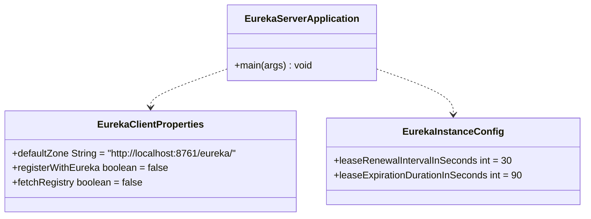

# Low-Level Design (LLD) — Netflix Eureka Naming Server (`eurekaserver`)

## 1. Class & Configuration Architecture



---

## 2. Configuration Properties Specifications (`application.properties`)

```properties
# Eureka Naming Server Port
server.port=8761
spring.application.name=eurekaserver

# Self-Registration Settings (Server Mode)
eureka.client.register-with-eureka=false
eureka.client.fetch-registry=false

# Lease Renewal & Heartbeat Standards
eureka.instance.lease-renewal-interval-in-seconds=30
eureka.instance.lease-expiration-duration-in-seconds=90

# Self-Preservation Settings
eureka.server.enable-self-preservation=true
eureka.server.eviction-interval-timer-in-ms=60000
```

---

## 3. Client Resiliency & Caching Configuration (For Microservices)

To ensure microservices do not crash when Eureka Server is temporarily down:

```properties
# Eureka Client Configuration (in microservices application.properties)
eureka.client.service-url.defaultZone=http://localhost:8761/eureka/
eureka.client.fetch-registry=true
eureka.client.registry-fetch-interval-seconds=30
eureka.client.eureka-service-url-poll-interval-seconds=300
```
