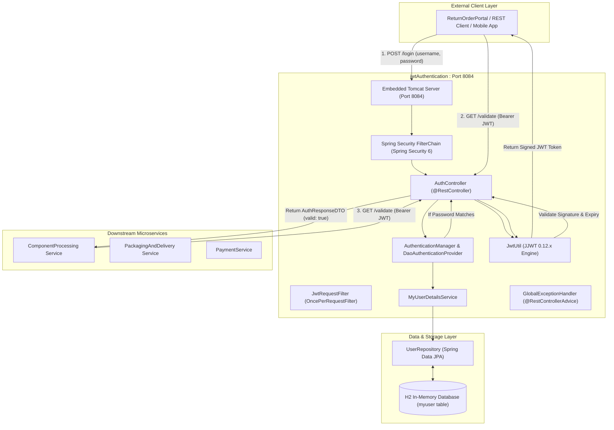
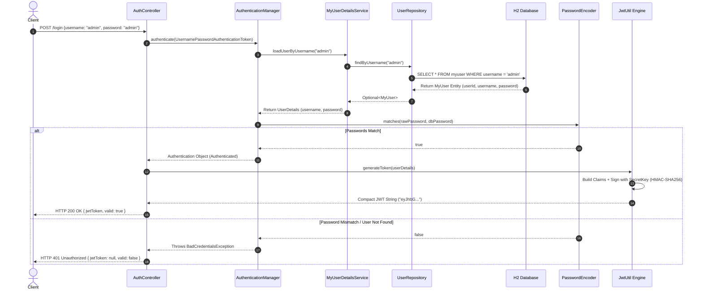
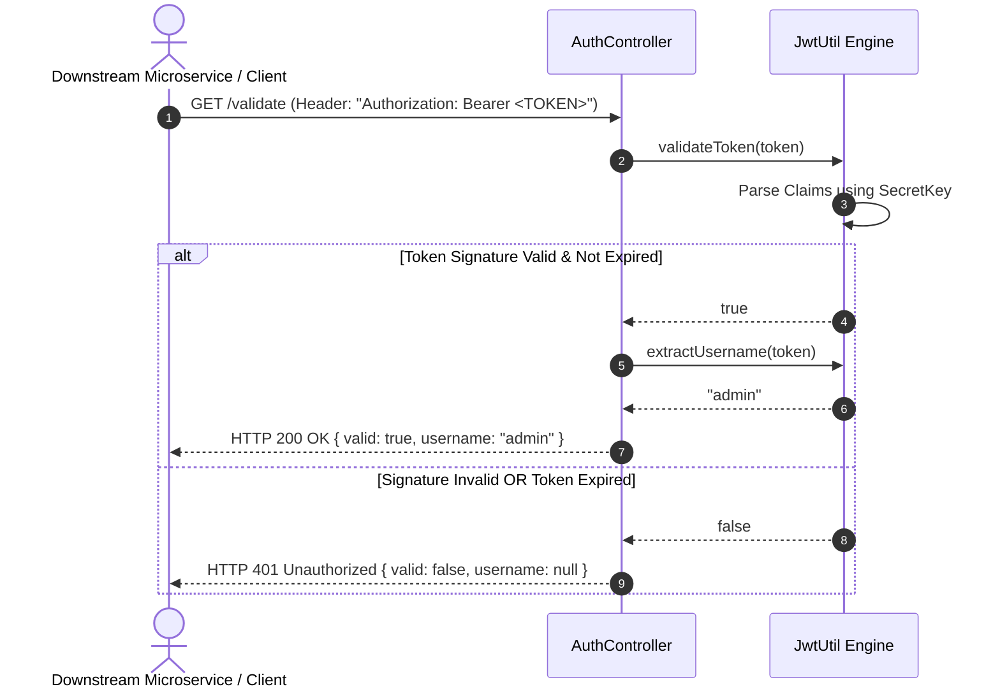

# High-Level Design (HLD) Document
## Microservice: `jwtAuthentication` (Authorization & Security Authority)

---

## 1. System Context & Architecture Overview

The **`jwtAuthentication`** microservice serves as the **Central Security & Identity Provider** for the Return Order Management Platform. 

In a distributed microservices environment, services cannot trust unauthenticated HTTP traffic. The `jwtAuthentication` microservice is responsible for:
1. **Authenticating User Credentials**: Validating usernames and passwords against persistent storage.
2. **Issuing Cryptographic JWT Tokens**: Creating signed, tamper-proof JSON Web Tokens (JWT) containing user identity and expiration claims.
3. **Validating Tokens for Downstream Microservices**: Verifying token signatures and expiration timestamps for services like `ComponentProcessing`, `PackagingAndDelivery`, and `PaymentService`.

---

## 2. High-Level Architecture Diagram



---

## 3. Interaction & Sequence Flows

### 3.1 Token Issuance Sequence (`POST /login`)



### 3.2 Token Validation Sequence (`GET /validate`)



---

## 4. Modernization Baseline (Spring Boot 3.4+ & Java 21)

| Dimension | Legacy Standard (Spring Boot 2.x) | Modern Production Standard (Our App) |
| :--- | :--- | :--- |
| **Java Baseline** | Java 8 / 11 | **Java 21 LTS** (Virtual Threads, Records) |
| **Servlet Namespace** | `javax.servlet.*` | **`jakarta.servlet.*`** |
| **Persistence Namespace**| `javax.persistence.*` | **`jakarta.persistence.*`** |
| **Spring Security** | `WebSecurityConfigurerAdapter` (Abstract Class) | **`SecurityFilterChain` Bean Injection** |
| **JWT Library** | `jjwt 0.9.1` (Deprecation & JAXB Crashes) | **`jjwt 0.12.6`** (Modular, SecretKey Enforcement) |
| **Data Objects** | Mutable Classes with Getters/Setters | **Java 21 `record` types** (`AuthRequestDTO`, `AuthResponseDTO`) |
| **API Documentation** | Springfox / Swagger 2 | **SpringDoc OpenAPI 3** (`/swagger-ui.html`) |

---

## 5. Deployment Topology (Docker Containerization)

```
┌──────────────────────────────────────────────────────────┐
│ HOST MACHINE (Windows / Linux / Cloud OS)                 │
│                                                          │
│  IntelliJ / Postman / Microservices                      │
│  http://localhost:8084 or http://127.0.0.1:8084          │
│           │                                              │
│           ▼                                              │
│  Docker Host Port Binding (-p 8084:8084)                 │
│           │                                              │
└───────────┼──────────────────────────────────────────────┘
            ▼
┌──────────────────────────────────────────────────────────┐
│ DOCKER CONTAINER (jwt-auth-container)                    │
│ Base Image: eclipse-temurin:21-jre-alpine                │
│                                                          │
│  ├── /app/app.jar (Compiled Spring Boot Application)     │
│  ├── Non-root User (appuser:appgroup)                    │
│  └── Internal Port: 8084                                 │
└──────────────────────────────────────────────────────────┘
```
