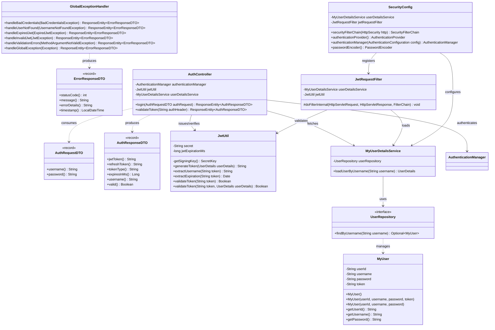

# Low-Level Design (LLD) Document
## Microservice: `jwtAuthentication`

---

## 1. Package & Component Structure

```text
com.company.authorizationservice
├── JwtAuthenticationApplication.java  <-- Bootstrap Main Class (@SpringBootApplication)
├── controller
│   └── AuthController.java            <-- REST Endpoints (/login, /validate)
├── dto
│   ├── AuthRequestDTO.java            <-- Java 21 Record (Login Payload)
│   ├── AuthResponseDTO.java           <-- Java 21 Record (JWT Token Payload)
│   └── ErrorResponseDTO.java          <-- Java 21 Record (Standard Error Payload)
├── entity
│   └── MyUser.java                    <-- JPA Database Entity (@Entity)
├── exception
│   └── GlobalExceptionHandler.java    <-- Centralized Exception Interceptor (@RestControllerAdvice)
├── repository
│   └── UserRepository.java            <-- Spring Data JPA Interface
├── security
│   ├── JwtUtil.java                   <-- JJWT 0.12.x Cryptographic Engine
│   ├── JwtRequestFilter.java          <-- OncePerRequestFilter Security Interceptor
│   └── SecurityConfig.java            <-- Spring Security 6 SecurityFilterChain Configuration
└── service
    └── MyUserDetailsService.java      <-- UserDetailsService Implementation
```

---

## 2. Low-Level Class Diagram



---

## 3. Database Schema Specification (H2 Database)

### Table: `myuser`

| Column Name | SQL Data Type | Constraint | Description |
| :--- | :--- | :--- | :--- |
| `user_id` | `VARCHAR(255)` | `PRIMARY KEY` | Unique ID / Primary Identifier |
| `username` | `VARCHAR(255)` | `NOT NULL` | User Login Username |
| `password` | `VARCHAR(255)` | `NOT NULL` | Plaintext / Encoded Password |
| `token` | `VARCHAR(255)` | `NULLABLE` | Optional Active Token Record |

### Database DDL (Generated by Hibernate):
```sql
CREATE TABLE myuser (
    user_id VARCHAR(255) NOT NULL,
    username VARCHAR(255),
    password VARCHAR(255),
    token VARCHAR(255),
    CONSTRAINT pk_myuser PRIMARY KEY (user_id)
);
```

---

## 4. API Endpoints Specification

### 4.1 Endpoint: `/login` (Issue Token)
* **HTTP Method**: `POST`
* **Content-Type**: `application/json`
* **Request Body**:
  ```json
  {
    "username": "admin",
    "password": "admin"
  }
  ```
* **Success Response (`200 OK`)**:
  ```json
  {
    "jwtToken": "eyJhbGciOiJIUzM4NCJ9...",
    "refreshToken": null,
    "tokenType": "Bearer",
    "expiresInMs": 3600000,
    "username": null,
    "valid": true
  }
  ```
* **Failure Response (`401 Unauthorized`)**:
  ```json
  {
    "jwtToken": null,
    "refreshToken": null,
    "tokenType": "Bearer",
    "expiresInMs": 3600000,
    "username": null,
    "valid": false
  }
  ```

---

### 4.2 Endpoint: `/validate` (Verify Token)
* **HTTP Method**: `GET`
* **Request Header**: `Authorization: Bearer <JWT_TOKEN_STRING>`
* **Success Response (`200 OK`)**:
  ```json
  {
    "jwtToken": "eyJhbG...",
    "refreshToken": null,
    "tokenType": "Bearer",
    "expiresInMs": 1800000,
    "username": "admin",
    "valid": true
  }
  ```
* **Failure Response (`401 Unauthorized`)**:
  ```json
  {
    "jwtToken": null,
    "refreshToken": null,
    "tokenType": "Bearer",
    "expiresInMs": 3600000,
    "username": null,
    "valid": false
  }
  ```
