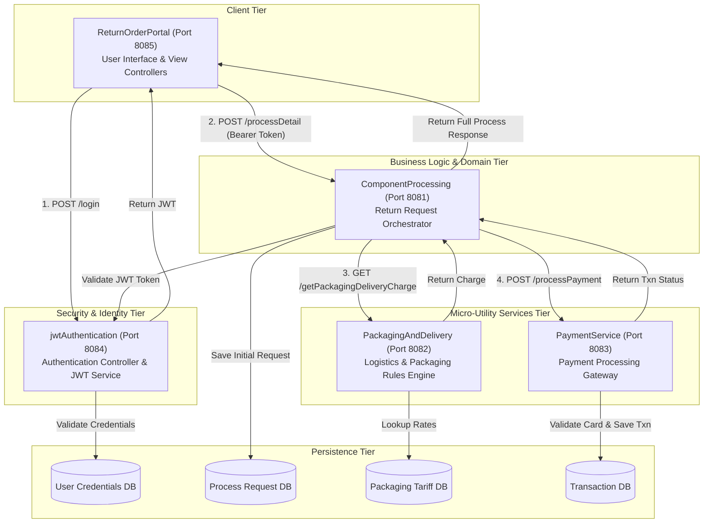
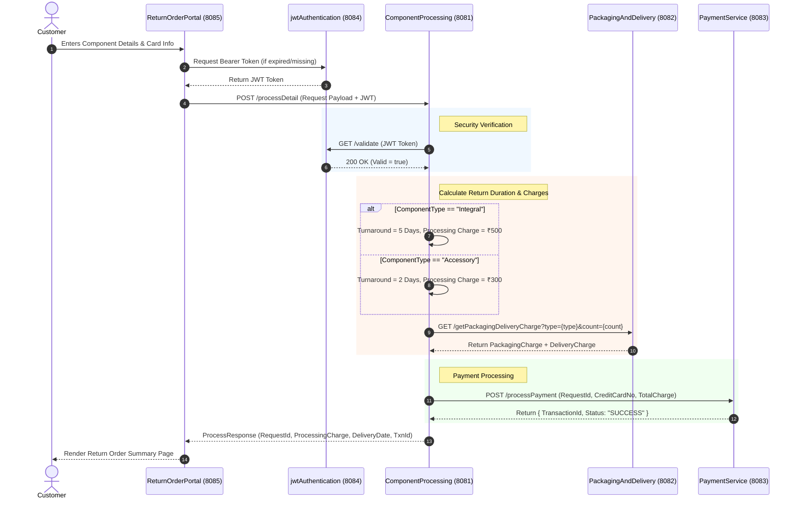

# Comprehensive High-Level Design (HLD) Document
## System: Return Order Management Microservices Platform

---

## 1. Executive Summary & Objective

The **Return Order Management Platform** is a distributed microservices system designed to process defective component return requests (repairs and replacements) for electronic products. 

The platform segregates concerns across 5 distinct services:
1. **`jwtAuthentication`**: Security authority issuing and validating JWTs.
2. **`ComponentProcessing`**: Core domain logic orchestrator handling return request lifecycle.
3. **`PackagingAndDelivery`**: Calculation engine for shipping and packaging costs.
4. **`PaymentService`**: Payment execution gateway for processing customer cards.
5. **`ReturnOrderPortal`**: User-facing web application client.

---

## 2. Microservice Topology & Port Mapping

| Service Name | Port | Description | Technology Stack |
| :--- | :--- | :--- | :--- |
| `jwtAuthentication` | `8084` / `8080` | User Auth & JWT Token Provider | Spring Boot 3.4+, Spring Security 6, JJWT |
| `ComponentProcessing` | `8081` | Core Return Order Orchestrator | Spring Boot 3.4+, Spring Data JPA, RestClient |
| `PackagingAndDelivery` | `8082` | Logistics & Packaging Cost Calculator | Spring Boot 3.4+, Spring Web |
| `PaymentService` | `8083` | Credit Card & Payment Gateway | Spring Boot 3.4+, Spring Data JPA |
| `ReturnOrderPortal` | `8085` | Web User Interface Client | Spring Boot 3.4+, Thymeleaf / Web Client |

---

## 3. High-Level System Architecture Diagram



---

## 4. Component Interaction & Sequence Diagrams

### 4.1 Component Return Request Lifecycle Flow



---

## 5. Domain Models & Data Specifications

### 5.1 Process Request (Domain Object / DTO)
* `requestId` (Long / String - Primary Key)
* `userName` (String)
* `contactNumber` (Long / String)
* `componentType` (Enum: `INTEGRAL`, `ACCESSORY`)
* `componentName` (String)
* `quantity` (Integer)
* `isPriorityRequest` (Boolean)

### 5.2 Process Response (Domain Object / DTO)
* `requestId` (Long / String)
* `processingCharge` (Double)
* `packagingAndDeliveryCharge` (Double)
* `dateOfDelivery` (LocalDate)
* `transactionId` (String / Long)

### 5.3 Payment Details (DTO)
* `requestId` (Long / String)
* `creditCardNumber` (Long / String)
* `creditLimit` (Double)
* `processingCharge` (Double)

---

## 6. Modernization & Migration Standards (Spring Boot 3.4+ & Java 21)

### 6.1 Key Code Changes Required
1. **Jakarta EE Migration**: Replace all `javax.persistence.*`, `javax.servlet.*`, `javax.validation.*` imports with `jakarta.persistence.*`, `jakarta.servlet.*`, `jakarta.validation.*`.
2. **Spring Security 6 Configuration**: Replace legacy security configuration:
   ```java
   // LEGACY (SPRING BOOT 2.X - DEPRECATED)
   @Configuration
   public class WebSecurityConfig extends WebSecurityConfigurerAdapter { ... }

   // MODERN (SPRING BOOT 3.4+ JAVA 21)
   @Configuration
   @EnableWebSecurity
   public class SecurityConfig {
       @Bean
       public SecurityFilterChain securityFilterChain(HttpSecurity http) throws Exception {
           return http
               .csrf(AbstractHttpConfigurer::disable)
               .authorizeHttpRequests(auth -> auth
                   .requestMatchers("/authenticate", "/h2-console/**").permitAll()
                   .anyRequest().authenticated()
               )
               .sessionManagement(sess -> sess.sessionCreationPolicy(SessionCreationPolicy.STATELESS))
               .build();
       }
   }
   ```
3. **Java 21 Records for DTOs**: Replace mutable getter/setter boilerplate with immutability:
   ```java
   public record ProcessRequestDTO(
       String userName,
       String contactNumber,
       String componentType,
       String componentName,
       int quantity
   ) {}
   ```
4. **Declarative HTTP Client / RestClient**:
   ```java
   // Modern Spring 6 RestClient replacing RestTemplate
   RestClient restClient = RestClient.builder()
       .baseUrl("http://localhost:8082")
       .build();
   ```

---

## 7. Individual Microservice Checkpoint Documentation Strategy

We will document each microservice with its own dedicated Checkpoint Specification:
- **`CP-01-JWT-AUTH.md`**: Authentication & Token Issuer Spec
- **`CP-02-PACKAGING-DELIVERY.md`**: Packaging & Delivery Calculator Spec
- **`CP-03-PAYMENT-SERVICE.md`**: Payment Processing Spec
- **`CP-04-COMPONENT-PROCESSING.md`**: Core Orchestrator Spec
- **`CP-05-RETURN-ORDER-PORTAL.md`**: Web Portal & UI Gateway Spec

---
