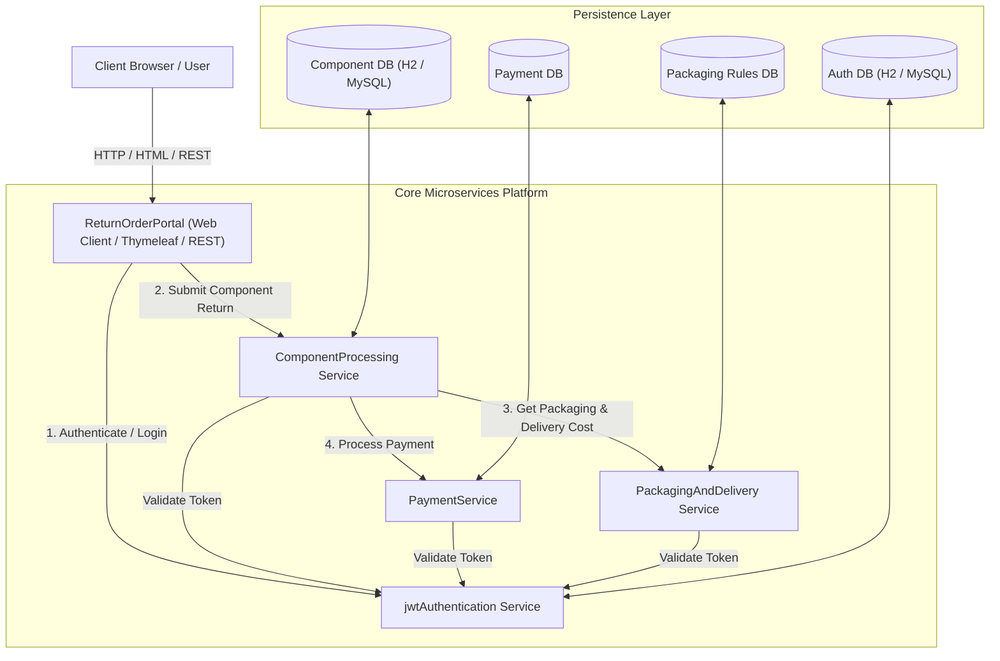
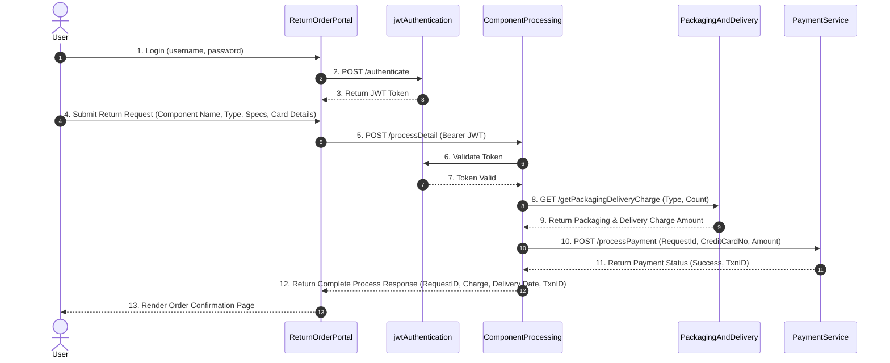

# High-Level Design (HLD) & Project Modernization Roadmap

## Overview
We are designing and modernizing a **Return Order Management Microservices System** using **Java 21** and **Spring Boot 3.4+**. 

The system handles customer requests for component repairs and replacements (e.g., defective electronics, accessories, integral parts), calculates packaging/delivery charges, processes payments securely using JWT authentication, and tracks status.

---

## System Microservices Architecture



---

## Detailed Microservices Breakdown

### 1. `jwtAuthentication` Service
* **Role**: Security & Identity Provider.
* **Responsibilities**:
  * Authenticates users (Username/Password).
  * Generates JWT (JSON Web Tokens) with claims & expiration.
  * Validates JWT tokens presented by downstream microservices.
* **Spring Boot 3.x Modernization**:
  * Upgrade JJWT library / Spring Security 6 `NimbusJwtDecoder`.
  * Replace deprecated `WebSecurityConfigurerAdapter` with `SecurityFilterChain` bean.
  * Migrated from `javax.servlet` to `jakarta.servlet`.

---

### 2. `ComponentProcessing` Service
* **Role**: Business Logic & Orchestration Service.
* **Responsibilities**:
  * Processes return requests based on component type (`Integral` vs `Accessory`).
  * Calculates expected turnaround duration (e.g., 5 days for Integral repair, 2 days for Accessory replacement).
  * Calls `PackagingAndDelivery` to compute logistics costs.
  * Calls `PaymentService` to execute card charges.
  * Maintains Return Order State (`Pending`, `Processing`, `Completed`).
* **Spring Boot 3.x Modernization**:
  * Use modern `RestClient` or Declarative HTTP Interfaces instead of deprecated/blocking `RestTemplate`.
  * Utilize Java 21 `Record` types for immutable DTOs and Request payloads.

---

### 3. `PackagingAndDelivery` Service
* **Role**: Logistics & Shipping Calculation Microservice.
* **Responsibilities**:
  * Computes packaging costs (e.g., protective packaging for fragile/integral items vs standard box for accessories).
  * Computes delivery charges based on item type and weight/location.
  * Returns total packaging & delivery charge to `ComponentProcessing`.
* **Spring Boot 3.x Modernization**:
  * Lightweight microservice utilizing pattern matching for switch statements (Java 21).

---

### 4. `PaymentService` Service
* **Role**: Financial Transaction Microservice.
* **Responsibilities**:
  * Receives credit card / payment details and processing charge from `ComponentProcessing`.
  * Validates card balance / limit.
  * Executes payment transaction and returns transaction status & ID.
* **Spring Boot 3.x Modernization**:
  * Isolated database schema for financial audit records.
  * Jakarta Persistence (`jakarta.persistence.*`) with Spring Data JPA.

---

### 5. `ReturnOrderPortal` (Frontend / Web Gateway)
* **Role**: Web UI Application / User Interface.
* **Responsibilities**:
  * Renders UI pages for Login, Process Return Request, Payment Confirmation, and Order Status.
  * Communicates with microservices via REST API client.
* **Spring Boot 3.x Modernization**:
  * Modern Thymeleaf UI with sleek dark/glassmorphic responsive styling or REST client gateway.

---

## End-to-End Sequence Flow



---

## Modernization Checklist: Spring Boot 3.4+ & Java 21

| Modern Feature | Legacy Spring Boot (Old) | Spring Boot 3.4+ (Modern) |
| :--- | :--- | :--- |
| **Java Baseline** | Java 8 / 11 | **Java 17 / 21 LTS** |
| **Servlet Namespace** | `javax.servlet.*` | **`jakarta.servlet.*`** |
| **JPA Namespace** | `javax.persistence.*` | **`jakarta.persistence.*`** |
| **Security Config** | `WebSecurityConfigurerAdapter` (Deprecated & Removed) | **`SecurityFilterChain` Bean Injection** |
| **HTTP Client** | `RestTemplate` / Old Feign | **`RestClient` / HTTP Declarative Interfaces / Feign 4** |
| **Data Transfer Objects** | Boilerplate Classes with Getters/Setters | **Java 21 `record` types** |
| **Concurrency** | Heavy Thread Pools | **Java 21 Virtual Threads (`spring.threads.virtual.enabled=true`)** |

---

## User Review Required

> [!IMPORTANT]
> **Multi-Module Project Architecture**
> We recommend building this as a **Clean Maven Multi-Module Project**:
> ```text
> return-order-system/
> ├── pom.xml (Parent POM managing Spring Boot 3.4.x, Java 21, and dependencies)
> ├── jwt-authentication-service/
> ├── component-processing-service/
> ├── packaging-delivery-service/
> ├── payment-service/
> └── return-order-portal/
> ```
> This keeps all 5 microservices organized under one root project in IntelliJ Ultimate while maintaining independent microservice execution and distinct ports!

---

## Open Questions for User

1. **Database Preference**: Would you like to use **H2 In-Memory Database** (for quick local testing and zero setup) or **MySQL / PostgreSQL** for persistence across services?
2. **Frontend Preference**: Would you like the `ReturnOrderPortal` to use **Modern Thymeleaf + Bootstrap/CSS** (server-side rendering) or a **REST API Backend + Single Page App**?

---

## Next Steps / Execution Plan

1. **Step 1: Checkpoints & Documentation Architecture** - Save detailed HLD and individual microservice technical specifications.
2. **Step 2: Parent Maven Project Creation** - Create root `pom.xml` with Spring Boot 3.4.x parent and Java 21 configuration.
3. **Step 3: Module-by-Module Building & Learning** - Build, refactor, and deep-dive explain each microservice class by class (`jwtAuthentication` first -> `PackagingAndDelivery` -> `PaymentService` -> `ComponentProcessing` -> `ReturnOrderPortal`).
