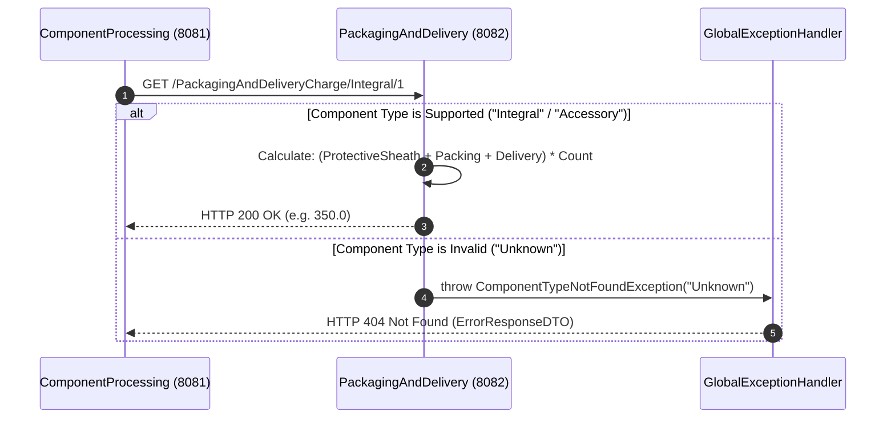

# High-Level Design (HLD) — Packaging & Delivery Microservice (`PackagingAndDelivery`)

## 1. System Overview & Bounded Context

The **Packaging & Delivery Microservice** (`packaginganddeliveryservice`, running on port **8082**) operates within the **Logistics & Freight Bounded Context** of the Return Order Processing Platform.

It provides real-time tariff calculation services to downstream order processing engines like `ComponentProcessing` (Port 8081). It determines exact packaging material costs (protective bubble wrap, static ESD shielding), freight handling charges, and delivery carrier rates based on hardware component categories (**Integral** vs **Accessory**) and defective quantity counts.

```
                           +----------------------------------+
                           |   ComponentProcessing (8081)     |
                           +----------------------------------+
                                             |
                                OpenFeign    | GET /PackagingAndDeliveryCharge/{type}/{count}
                                Synchronous  v
                           +----------------------------------+
                           | PackagingAndDelivery (Port 8082) |
                           +----------------------------------+
```

---

## 2. Key Responsibilities

1. **Tariff Rule Engine**: Evaluates item category rules to compute unit packaging, protective sheath, and shipping carrier tariffs.
2. **Thread-Safe Stateless Calculations**: Ensures zero-state concurrency safety across high-volume simultaneous customer return calculations.
3. **Decoupled Freight Logistics**: Enables logistics teams to update shipping rate schedules independently without re-deploying core order processing services.
4. **Structured Error Handling**: Converts unsupported component categories into HTTP 404 Not Found responses via `@RestControllerAdvice`.

---

## 3. Microservice Interaction Sequence Diagram



---

## 4. Tariff Rate Card Matrix

| Component Category | Protective Sheath | Category Packing | Freight Delivery | Unit Rate / Item | Formula (`count = N`) |
| :--- | :--- | :--- | :--- | :--- | :--- |
| **Integral** (Laptops, Phones, Boards) | ₹50.0 | ₹100.0 | ₹200.0 | **₹350.0** | `(50 + 100 + 200) * N` |
| **Accessory** (Cables, Chargers, Headsets) | ₹50.0 | ₹50.0 | ₹100.0 | **₹200.0** | `(50 + 50 + 100) * N` |

---

## 5. Security & Deployment Architecture

- **Stateless Web Security**: Configures Spring Security 6 with `SessionCreationPolicy.STATELESS` and permits public access to `/PackagingAndDeliveryCharge/**`.
- **Docker Multi-Stage Build**: Built via `maven:3.9.6-eclipse-temurin-21-alpine` and executed on `eclipse-temurin:21-jre-alpine` under unprivileged user `appuser`.
