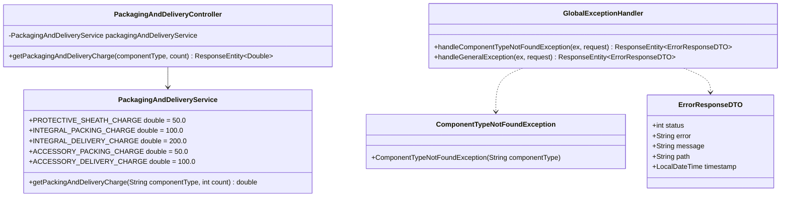

# Low-Level Design (LLD) — Packaging & Delivery Microservice (`PackagingAndDelivery`)

## 1. Class Diagram Architecture



---

## 2. Package Structure & Layout

```text
com.company.packaginganddeliveryservice
├── controller/                 # REST Controllers
│   └── PackagingAndDeliveryController.java
├── dto/                        # Java 21 Record DTOs
│   └── ErrorResponseDTO.java
├── exception/                  # Exception Hierarchy & Global Handlers
│   ├── ComponentTypeNotFoundException.java
│   └── GlobalExceptionHandler.java
├── security/                   # Web Security Configuration
│   └── SecurityConfig.java
└── service/                    # Tariff Rule Engine
    └── PackagingAndDeliveryService.java
```

---

## 3. OpenAPI 3 REST Endpoint Specifications

### Endpoint: `GET /PackagingAndDeliveryCharge/{componentType}/{count}`

- **Summary**: Calculate Component Packaging and Delivery Tariff.
- **Path Parameters**:
  - `componentType` (String, Required): Category identifier (`Integral` or `Accessory`).
  - `count` (Integer, Required): Number of defective items.
- **Responses**:
  - `200 OK`: Returns total cost as numeric `Double` (e.g. `350.0`).
  - `404 Not Found`: Returns `ErrorResponseDTO` when `componentType` is invalid.
  - `400 Bad Request`: Returns `ErrorResponseDTO` when `count <= 0`.
