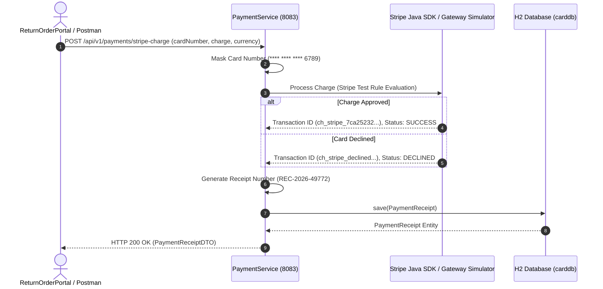

# High-Level Design (HLD) — Payment Microservice (`PaymentService`)

## 1. System Overview & Gateway Architecture

The **Payment Microservice** (`paymentservice`, running on port **8083**) is the financial processing engine of the Return Order Processing Platform. 

It provides an enterprise dual-payment model:
1. **Legacy & Inter-Service Feign Compatibility Endpoint** (`GET /card/{cardNumber}/{charge}`): Provides synchronous credit card balance validation and deduction for internal microservices (`ComponentProcessing`).
2. **Modern Payment Gateway & Stripe Integration Engine** (`POST /api/v1/payments/stripe-charge`): Simulates live payment gateway interactions (Stripe / Razorpay), supports Stripe Test Cards, enforces PCI-DSS compliant credit card masking (`**** **** **** 6789`), and generates **Official Digital Payment Receipts** (`PaymentReceiptDTO`).

```
                            +----------------------------------+
                            |   ComponentProcessing (8081)     |
                            +----------------------------------+
                                             |
                                OpenFeign    | GET /card/{cardNumber}/{charge}
                                Synchronous  v
                            +----------------------------------+
                            |     PaymentService (Port 8083)   |
                            +----------------------------------+
                               /             |              \
               Internal Ledger/              | Audit Trail   \ Stripe Gateway
                             v               v                v
                 +-------------------+  +-------------------+  +-------------------+
                 | H2: CREDIT_CARD   |  | H2: PAYMENT_RECEIPT| | Stripe Gateway API |
                 | (Balance Ledger)  |  |  (Digital Audit)  |  |  (Test Mode SDK)  |
                 +-------------------+  +-------------------+  +-------------------+
```

---

## 2. Key Responsibilities

1. **Payment Gateway Simulation & Integration**: Supports Stripe test card numbers (`4242...` for success, ending in `0002` for decline) and Stripe API keys.
2. **Digital Payment Receipt Engine**: Generates unique transaction IDs (`ch_stripe_...`), official receipt numbers (`REC-2026-XXXXX`), ISO currency codes, masked card numbers, and timestamps.
3. **PCI-DSS Compliance Layer**: Prevents unmasked credit card numbers from being stored in receipt audit tables.
4. **Inter-Service Feign Compatibility**: Satisfies existing OpenFeign client interfaces without breaking upstream workflows.

---

## 3. Stripe Gateway Payment Sequence Diagram



---

## 4. Digital Receipt Data Payload Structure

```json
{
  "transactionId": "ch_stripe_7ca25232cb224df6",
  "receiptNumber": "REC-2026-49772",
  "cardNumberMasked": "**** **** **** 6789",
  "amountPaid": 700.0,
  "currency": "INR",
  "paymentStatus": "SUCCESS",
  "paymentProvider": "STRIPE_GATEWAY",
  "timestamp": "2026-08-14T00:13:20.0457195",
  "message": "Stripe Payment Charge Authorized Successfully"
}
```

---

## 5. Security & PCI-DSS Compliance

- **No Raw Storage**: Credit card numbers are never stored in raw form inside receipt audit logs. Only masked 4-digit trailing identifiers are persisted (`cardNumberMasked`).
- **Stateless Web Security**: Configures Spring Security 6 with `SessionCreationPolicy.STATELESS` and permits public access to `/card/**` and `/api/v1/payments/**`.
- **Docker Multi-Stage Build**: Packaged via `eclipse-temurin:21-jre-alpine` running under unprivileged user `appuser`.
