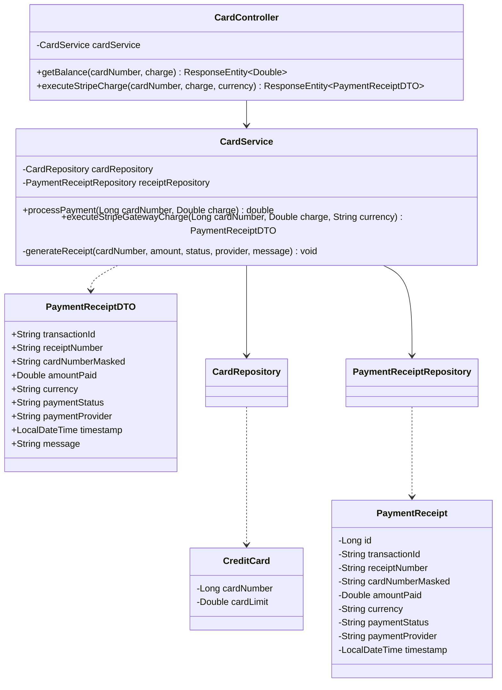
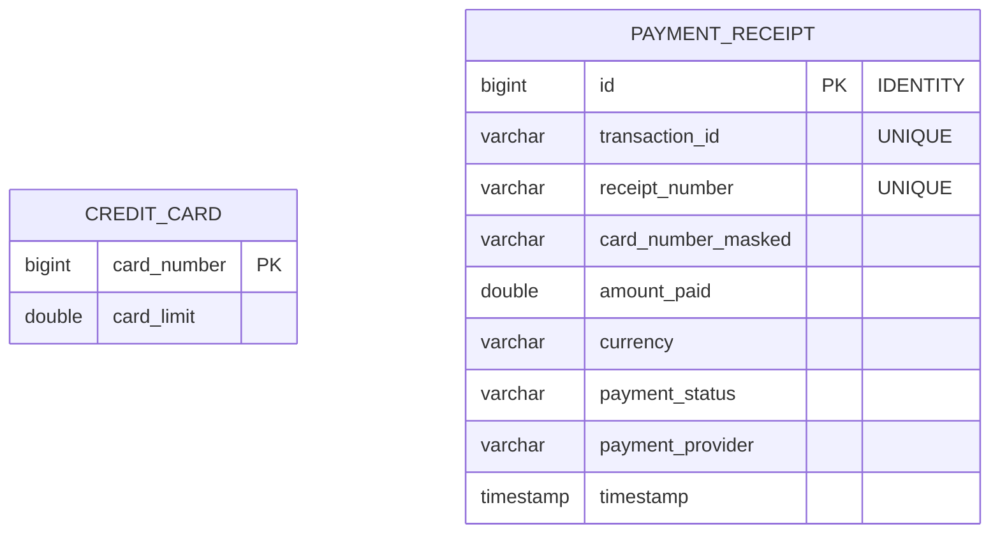

# Low-Level Design (LLD) — Payment Microservice (`PaymentService`)

## 1. Class Diagram Architecture



---

## 2. Package & Structural Layout

```text
com.company.paymentservice
├── controller/                 # REST Controllers
│   └── CardController.java
├── dto/                        # Java 21 Record DTOs
│   ├── ErrorResponseDTO.java
│   └── PaymentReceiptDTO.java  # Digital Receipt Payload
├── entity/                     # JPA Database Entities
│   ├── CreditCard.java         # Legacy Card Limit Ledger
│   └── PaymentReceipt.java     # Digital Receipt Audit Table
├── exception/                  # Exception Hierarchy & Global Handlers
│   ├── CardNotFoundException.java
│   └── GlobalExceptionHandler.java
├── repository/                 # Spring Data JPA Repositories
│   ├── CardRepository.java
│   └── PaymentReceiptRepository.java
├── security/                   # Web Security Configuration
│   └── SecurityConfig.java
└── service/                    # Business & Gateway Logic
    └── CardService.java
```

---

## 3. Database Schema DDL & Entity Relationship (ER) Diagram



### SQL DDL Statements (H2 / MySQL Compatible)

```sql
CREATE TABLE credit_card (
    card_number BIGINT PRIMARY KEY,
    card_limit DOUBLE NOT NULL
);

CREATE TABLE payment_receipt (
    id BIGINT AUTO_INCREMENT PRIMARY KEY,
    transaction_id VARCHAR(255) NOT NULL UNIQUE,
    receipt_number VARCHAR(255) NOT NULL UNIQUE,
    card_number_masked VARCHAR(50) NOT NULL,
    amount_paid DOUBLE NOT NULL,
    currency VARCHAR(10) NOT NULL,
    payment_status VARCHAR(50) NOT NULL,
    payment_provider VARCHAR(50) NOT NULL,
    timestamp TIMESTAMP NOT NULL
);
```

---

## 4. DTO Specifications (Java 21 Record)

### `PaymentReceiptDTO`
```java
public record PaymentReceiptDTO(
    String transactionId,
    String receiptNumber,
    String cardNumberMasked,
    Double amountPaid,
    String currency,
    String paymentStatus,
    String paymentProvider,
    LocalDateTime timestamp,
    String message
) {}
```
