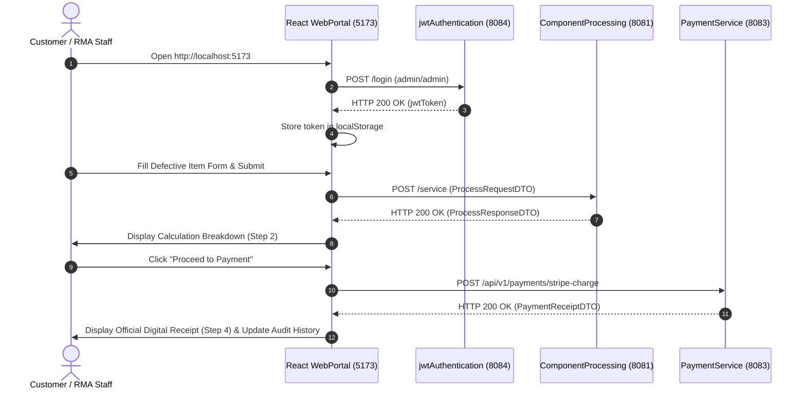

# High-Level Design (HLD) — React Web Portal (`webportal`)

## 1. System Overview & SPA Architecture

The **Web Portal** (`webportal`, running on **`http://localhost:5173`**) is the modern React Single-Page Application (SPA) frontend for the Return Order Processing Platform. 

It replaces legacy server-side JSP templates with a component-driven, responsive UI built using **Vite, React 18, Lucide React, and Vanilla CSS**. It interacts directly with the microservices mesh via a centralized Axios API client.

```
                           +----------------------------------+
                           |  React SPA WebPortal (Port 5173) |
                           +----------------------------------+
                                  /         |         \
                                 /          |          \
                 JWT Token      /   Service |           \ Stripe Charge
                Authentication /   Details |             \ & Receipt
                              v             v              v
                        +-----------+ +-----------+ +-----------+
                        | Auth      | | Processing| | Payment   |
                        | Service   | | Service   | | Service   |
                        | Port 8084 | | Port 8081 | | Port 8083 |
                        +-----------+ +-----------+ +-----------+
                                            |
                                            | OpenFeign
                                            v
                                      +-----------+
                                      | Logistics |
                                      | Service   |
                                      | Port 8082 |
                                      +-----------+
```

---

## 2. Key Component Responsibilities

1. **`Navbar.jsx`**: Platform branding, active user session pill, and real-time microservice mesh health indicators (Ports 8084, 8081, 8082, 8083).
2. **`LoginModal.jsx`**: JWT Authentication modal supporting quick test credentials (`admin`/`admin`).
3. **`ReturnOrderForm.jsx`**: Defective component return form supporting preset hardware items (MacBook Display, Galaxy Logic Board, etc.) and priority expedite toggles.
4. **`CalculationReview.jsx`**: Calculation breakdown card rendering processing fee, packaging tariff, total charge, and delivery turnaround.
5. **`PaymentModal.jsx`**: Stripe Gateway checkout modal with quick test card autofills (`4532 8901 2345 6789` for Success, `...0002` for Decline).
6. **`DigitalReceiptModal.jsx`**: Official Digital Payment Receipt presentation with print/download capabilities.
7. **`OrderHistoryTable.jsx`**: Real-time audit log tracking submitted return orders and processing statuses.

---

## 3. End-to-End User Flow Sequence Diagram



---

## 4. UI Design System Principles

- **Fluid Responsiveness**: Adapts dynamically across mobile, tablet, and desktop viewports.
- **Glassmorphism Styling**: Uses backdrop blur effects, curated HSL color tokens, and micro-interactions.
- **Print Optimization**: Includes `@media print` rules to render clean physical invoices when printing digital receipts.
