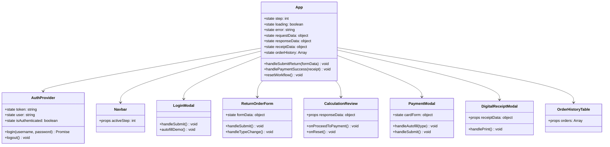
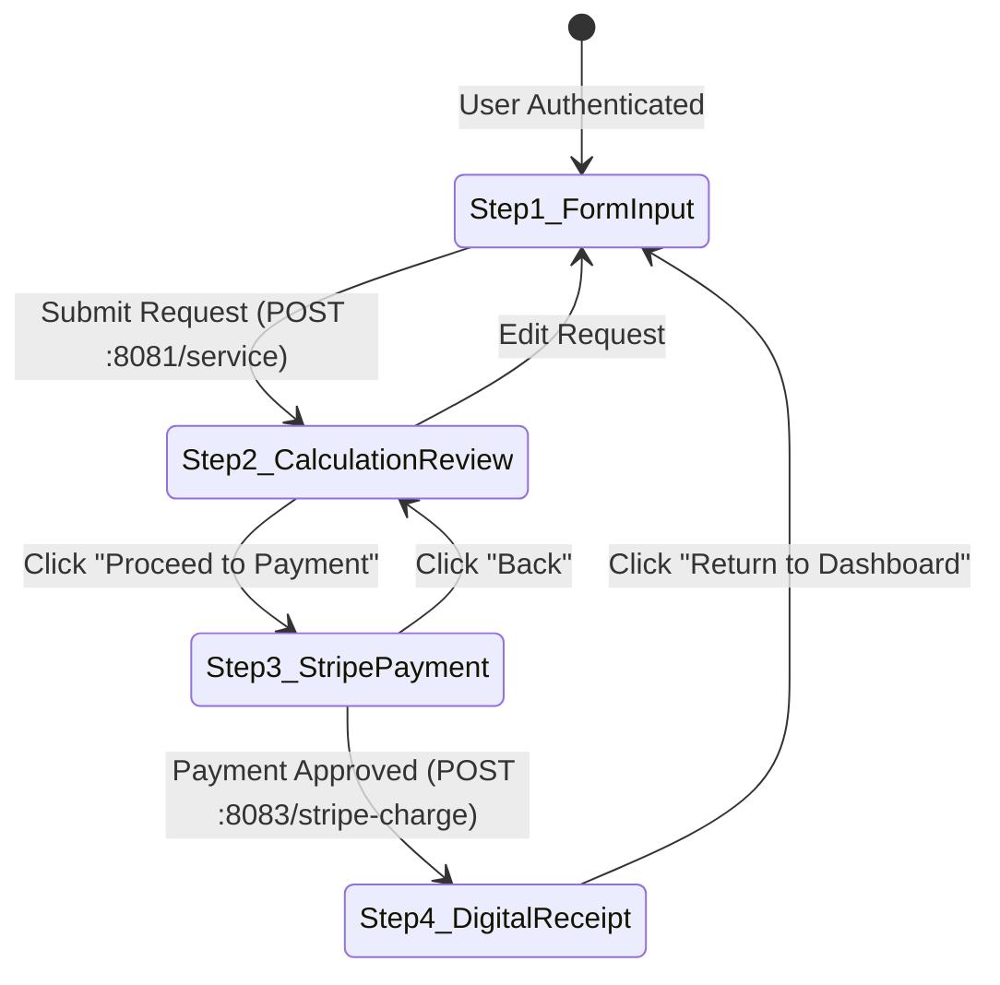

# Low-Level Design (LLD) — React Web Portal (`webportal`)

## 1. React Component Tree & State Hierarchy



---

## 2. Stepper Progression State Machine Specifications



---

## 3. Directory Layout

```text
webportal/
├── index.html
├── package.json
├── vite.config.js
└── src/
    ├── main.jsx
    ├── App.jsx
    ├── index.css
    ├── context/
    │   └── AuthContext.jsx
    ├── services/
    │   └── api.js
    └── components/
        ├── Navbar.jsx
        ├── LoginModal.jsx
        ├── ReturnOrderForm.jsx
        ├── CalculationReview.jsx
        ├── PaymentModal.jsx
        ├── DigitalReceiptModal.jsx
        └── OrderHistoryTable.jsx
```

---

## 4. Axios API Interceptor Specification (`api.js`)

```javascript
api.interceptors.request.use((config) => {
  const token = localStorage.getItem('auth_token');
  if (token) {
    config.headers.Authorization = token.startsWith('Bearer ') ? token : `Bearer ${token}`;
  }
  return config;
});
```
